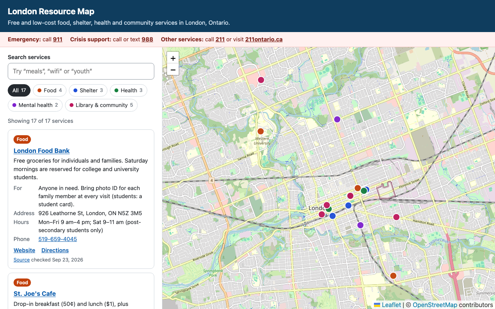

# London Resource Map

An interactive map of free and low-cost food, shelter, health, mental health and community services in London, Ontario.

**Live site:** https://hariraamthiru.github.io/london-resource-map/



## Why this exists

People looking for help usually have to piece together information from many websites and PDFs, often on a phone and in a hurry. This app puts the essentials in one place: what a service offers, who it's for, when it's open, and how to get there.

## Features

- **17 real services in 5 categories:** food, shelter, health, mental health, and library & community. Each one has its hours, phone number, who it's for, and a link to where the information came from.
- **Search and filters:** search by keyword (try "meals", "wifi" or "youth") and filter by category. Counts update as you type.
- **List and map stay in sync:** click a service in the list to fly to it on the map, or click a marker to jump to its card in the list.
- **Urgent help on every screen:** 911 for emergencies, 988 for crisis support, and 211 for everything else.
- **Works on phones:** the layout stacks and the map stays easy to use.
- **Accessible:** it works with a keyboard and a screen reader, and the list shows everything the map does. See [Accessibility](#accessibility).

## Built with

- [React](https://react.dev) and [Vite](https://vite.dev)
- [Leaflet](https://leafletjs.com) and [React Leaflet](https://react-leaflet.js.org), with free [OpenStreetMap](https://www.openstreetmap.org) map tiles (no API key needed)
- [Vitest](https://vitest.dev) for tests
- GitHub Actions, which tests, builds and deploys the site to GitHub Pages on every push to `main`

## How it works

- **`src/data/resources.json`** holds the services. Each entry includes its source and the date it was checked.
- **`scripts/geocode.mjs`** turns street addresses into map coordinates using OpenStreetMap's free Nominatim geocoder, sending at most one request per second as its usage policy asks.
- **`src/lib/filterResources.js`** handles search and filtering. It's a pure function, so it's easy to test.
- **`src/data/resources.test.js`** checks every entry: required fields, a valid category, `https` links, and coordinates inside London. A bad data edit fails the build before it reaches the live site.

## Data

The details come from [Information London](https://www.informationlondon.ca), a local directory of community and social services, and from the organizations' own websites. They were checked on September 23, 2026. Hours and services change, so the app asks people to call ahead.

Shelters that keep their locations private for safety are left off the map on purpose. The app directs people to 211 instead.

This is a student project and isn't affiliated with any of the organizations listed.

## Accessibility

- An [axe-core](https://github.com/dequelabs/axe-core) scan (WCAG 2.1 AA plus best practices) reports no violations.
- Filter buttons tell screen readers whether they're on or off, and the results count is announced when it changes.
- Category colors meet WCAG AA contrast with white text. Every category is also named in text, so color is never the only clue.
- Links that open a new tab say so to screen reader users.

## Run it locally

You'll need [Node.js](https://nodejs.org) 22.12 or newer.

```bash
npm install
npm run dev
```

Then open http://localhost:5173/london-resource-map/.

```bash
npm test
```

To add a service, add an entry to `src/data/resources.json` with `"lat": null` and `"lng": null`, then run `npm run geocode` to fill in its coordinates.

## What's next

- An **"Open now"** filter. This needs hours stored as structured data instead of text.
- **"Near me"** sorting using the browser's location
- **French** and other languages
- A way for organizations to **suggest updates** to their listing

## Credits

Map data © [OpenStreetMap](https://www.openstreetmap.org/copyright) contributors. Service information comes from [Information London](https://www.informationlondon.ca) and the organizations listed.
